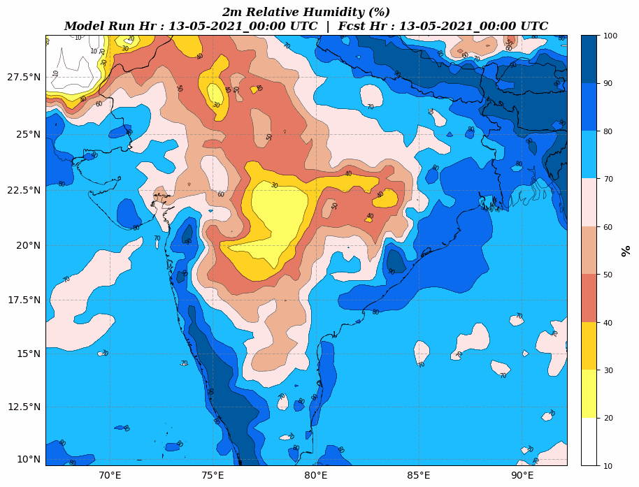

==================
Make Animation
==================

Enable animation option
~~~~~~~~~~~~~~~~~~~~~~~

It is possible to generate animation using `wrfplot`. The animation files are saved in GIF format. To create an animation, simple pass ``--gif`` option as part of command line arguments. By default, the speed of the animation is set as 0.5 seconds. Sample usage is as follows::

	$ wrfplot --vars "rh2" --gif --input ../../test/wrfout_d01_2016-03-30_00_00_00 --vars "rh2" --output ~/Documents/wrfplot_output

When the complete plotting is over, you can see the message indicating the location of animation file as indicated below::

	Plotting of variable "rh2" completed...
	Animation (GIF) file created at "/mnt/WRF_TEST_FILES/output_images/rh2.gif" 
	Plotting process completed...

and the final animation image will look like below:

Control animation Speed
~~~~~~~~~~~~~~~~~~~~~~~

It is possible to control the speed of the animation by supplying an additional option ``--gif-speed``. The speed should be supplied in float or int. The speed here indicates how fast the frame moving from one to another. If speed value is less, the speed of animation would be more. In this example, the above command supplied with an additional option to change speed of animation::

	$ wrfplot --vars "rh2" --gif --gif-speed 0.1 --input ../../test/wrfout_d01_2016-03-30_00_00_00 --vars "rh2" --output ~/Documents/wrfplot_output

The change in speed of the animation can be seen below which was produced by above command

