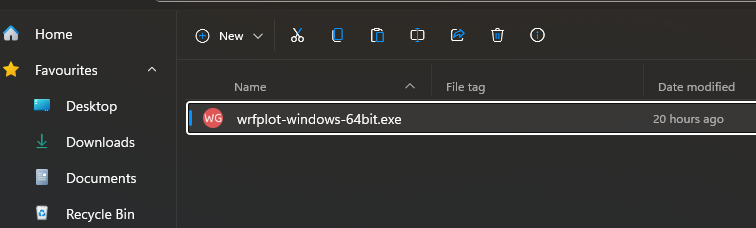

==================
Installation Guide
==================

System Requirements
~~~~~~~~~~~~~~~~~~~

Here are following dependencies you should know about before installing `wrfplot`:

* Operating System (Windows): Windows 10 or above. May work on Windows 7/ 8 but not tested.
* Operating System (Linux): Ubuntu 18.04 or above. If you wish to use it on Red Hat or Cent OS based, then it should be version 7 or above.
* Architecture: x86_64 or simple called 64bit. Don not download if you have 32bit machine. It won't work.

Since it is intended to be used as command line, the application is distributed as stand-alone on both Linux and Windows. You must download the correct version of application installer or setup file. Both are described below:

Installation on all Platforms (Windows, Linux and Mac OS)
~~~~~~~~~~~~~~~~~~~~~~~~~~~~~~~~~~~~~~~~~~~~~~~~~~~~~~~~~~

Support for all platforms is provided through `conda-forge`. If you have already miniconda or anaconda installed, then following command is enough to install `wrfplot`::

	$ conda install -c cond-forge wrfplot

Check your installation by typing following command which should show the version number::

	$ wrfplot --version
	0.1.0

Windows Only
~~~~~~~~~~~~

Go to https://github.com/wxguy/wrfplot/releases and look for latest release. The Windows setup executable will have name `wrfplot-windows-64bit.exe`. Click on the link and download it to local disk. The rest of the installation procedure is same as you do for any other windows setup files. Here are the complete process of installing in visual format:

  
  Windows Setup File 

.. figure:: _static/images/screenshots/2-user-elivation.png
  :width: 400
  :alt: Windows User Elevation

  Windows User Elevation

.. figure:: _static/images/screenshots/3-windows-welcome-screen.png
  :width: 400
  :alt: Windows Welcome Screen

  Windows Welcome Screen

.. figure:: _static/images/screenshots/4-windows-user-agreement.png
  :width: 400
  :alt: Windows User Agreement

  Windows User Agreement

.. figure:: _static/images/screenshots/5-windows-install-options.png
  :width: 400
  :alt: Windows Install Options

  Windows Install Options

.. figure:: _static/images/screenshots/6-windows-destination-dir.png
  :width: 400
  :alt: Windows Install Directory

  Windows Install Directory

.. figure:: _static/images/screenshots/7-windows-install-progress.png
  :width: 400
  :alt: Windows Install Progress

  Windows Install Progress

.. figure:: _static/images/screenshots/8-windows-install-finish.png
  :width: 400
  :alt: Windows Finish Screen

  Windows Finish Screen

That's it. You have successfully installed `wrfplot`.

Linux Only
~~~~~~~~~~

 Go to https://github.com/wxguy/wrfplot/releases and look for latest release. The Linux installer will have name `wrfplot-linux-64bit.run`. Click on the link and download it to local disk. Thereafter execute the below command (assuming that the Linux installer is downloaded at `~/Downloads`)::

 	$ bash ~/Downloads/wrfplot-linux-64bit.run
 

 that would produce the output as indicated below::

	Verifying archive integrity...  100%   MD5 checksums are OK. All good.
	Uncompressing wrfplot_Linux_Installer  100%  
	Removing previous install directory...
	Installing wrfplot to /home/wxguy/.wrfplot...
	Renaming '/home/wxguy/wrfplot' directory to '/home/wxguy/.wrfplot'..
	'/home/wxguy/.local/bin' directory already exists. Not creating it.
	Linking wrfplot executable...
	Updating .bashrc file to include install directory...
	/home/wxguy/.local/bin directory already added to PATH. Skipping...
	Installation completed. Please restart your terminal to continue using wrfplot...

Confirm Installation
~~~~~~~~~~~~~~~~~~~~~

Once you install wrfplot using one of the above mentioned, you must ensure that it is installed successfully. For this you can execute following command from terminal on Linux or cmd on Windows::

	$ wrfplot --help
	usage: wrfplot.py [-h] [--list-vars] [--input <input_file>] [--output <output_dir>]
                  [--vars <variables>] [--ulevels <upper-levels>] [--list-cmaps]
                  [--cmap <cmap-name>] [--dpi <value>] [--gif] [--gif-speed <seconds>] [--version]

	Command line application to plot static WRF model prognostic products...

	options:
	  -h, --help            show this help message and exit
	  --list-vars           Show list of variables supported by wrfplot and exit.
	  --input <input_file>  Path to WRF generated netCDF.
	  --output <output_dir>
	                        Path to output directory for saving plotted images.
	  --vars <variable(s)>  Name of the variable to be plotted. Multiple variables are to be separated
	                        with ','. Use '--list-vars' option to see list of supported variables.
	  --ulevels <upper-levels>
	                        Provide custom upper level(s) when plotting upper atmospheric data. Each
	                        level is to be seperated by ',' i.e., '925,850,700'. Use '--list-vars' to
	                        know list of supported upper level variables.
	  --list-cmaps          List colour maps (cmaps) supported by wrfplot. Refer
	                        https://pratiman-91.github.io/colormaps for information on each colourmaps.
	  --cmap <cmap-name>    Valid colormap name to fill colors. Use '--list-cmaps' option to see list
	                        of supported colormaps. Must have minimum 11 colors, else will lead to
	                        error.
	  --dpi <value>         Increase or decrease the plotted image resolution. Default is 125. More is
	                        higher resolution and less is course resolution. Higher values will reduce
	                        the speed of plot.
	  --gif                 If applied, creates an animated GIF image. GIF image will be saved same
	                        location as other images with a name specifed in '--vars' option.
	  --gif-speed <seconds>
	                        Set speed of GIF frame in seconds. Default is 0.5 sec. Lower value
	                        increases the speed of animation. To be used with '--gif' option to take
	                        effect.
	  --version             Print version information of application and exit.

	© J Sundar, wrf.guy@gmail.com, 2023

If you get inbuilt help page of ``wrfplot``, then it is ensured that you have successfully installed wrfplot.
