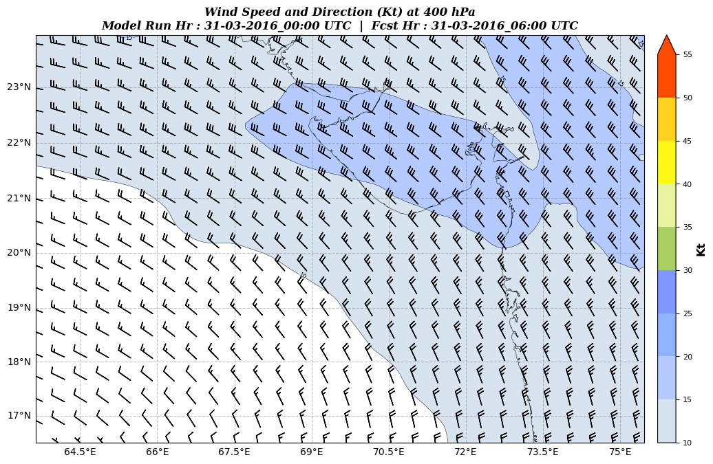

===========================
Upper Atmospheric Variables
===========================

Standard atmospheric levels 
~~~~~~~~~~~~~~~~~~~~~~~~~~~

`wrfplot` supports a few upper atmospheric variables. These variables are indicated with ``u_`` tag for ease of identification. By default, the plot for upper atmospheric variables would be plotted for standard atmospheric levels viz., ``925, 850, 700, 600, 500, 400, 300`` & ``200hPa``. The upper levels can be controlled using ``--ulevels`` though. If you want to plot upper winds on all standard atmospheric levels, you can specify only variable with following command::

	$ wrfplot --vars "u_winds" --input ../../test/wrfout_d01_2016-03-30_00_00_00 --vars "rh2" --output ~/Documents/wrfplot_output

Note that the wrf output file resolution is very high. However, `wrfplot` automatically calculates the correct resolution and size to fit the wind barbs within plot area. The above command would produce the plot as indicated above. Only 400hPa level plot is indicated below to ensure that page is not loaded with only images.

User defined levels
~~~~~~~~~~~~~~~~~~~

`wrfplot` gives you more option to control the levels in which variables are to be plotted. For example, if you wish to plot variables only at ``850``, ``700`` and ``500hPa``, then you must use ``--ulevels`` option followed by list of levels as indicated below::

	$ wrfplot --vars "u_td" --ulevels "850,700,500" --input ../../test/wrfout_d01_2016-03-30_00_00_00 --vars "rh2" --output ~/Documents/wrfplot_output

The above command should produce the images for prognostic chart of 'Dew Point Temperature' for all times confirming to only 850, 700 and 500hPa levels. The sample output is indicated below.

.. image:: _static/images/u_td.png
  :width: 800
  :alt: Alternative text

.. tip::
	The '--ulevels' will only accept digits. If it is not in digits, they are omitted and accepted levels only will be taken for plot. It is also not mandatory to keep the levels sorted. 

You can also control colormaps of variables as per user's choice with additional command line options. They are described in next page.
