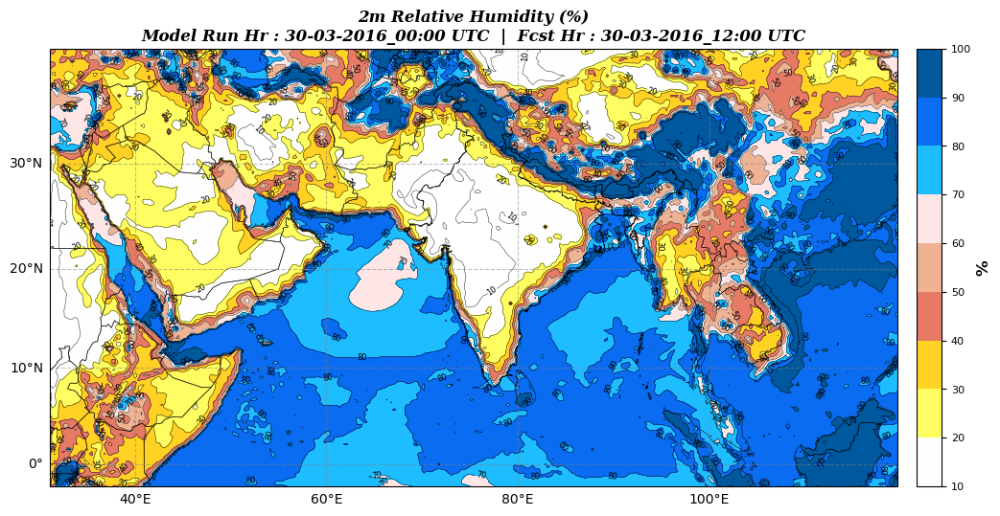

==================
How to use wrfplot
==================

The first step in plotting diagnostic variable to find what all variables are supported by ``wrfplot`` application. This is required as the application would accept variable names only in certain string format. Therefore, you should list and review the name of variable by issuing  following command in terminal::

	$ wrfplot --list-vars

Invoking the above command will produce the following output::

	****    ****    ****    ****    ****    ****    ****
	Variables starting with 'u_' are upper air variable availabe at 925, 850, 700, 600, 500, 400, 300 and 200 hPa heights...
	****    ****    ****    ****    ****    ****    ****

	Variable "slp"   --> "Mean Sea Level Pressure" ("hPa")
	Variable "winds"   --> "10M Surface Winds" ("Kt")
	Variable "rh2"   --> "2m Relative Humidity" ("%")
	Variable "T2"   --> "2m Temperature" ("°C")
	Variable "mcape"   --> "CAPE Maximum" ("$J kg^{1}$")
	Variable "mcin"   --> "Minimum Convective Inhibition " ("$J kg^{1}$")
	Variable "lcl"   --> "Lifting Condensation Level" ("Meters")
	Variable "lfc"   --> "Level of Free Convection" ("Meters")
	Variable "ctt"   --> "Cloud Top Temperature" ("°C")
	Variable "low_cloudfrac"   --> "Low Cloud Coverage" ("%")
	Variable "mid_cloudfrac"   --> "Medium Cloud Coverage" ("%")
	Variable "high_cloudfrac"   --> "High Cloud Coverage" ("%")
	Variable "mdbz"   --> "Maximum Reflectivity" ("dBZ")
	Variable "helicity"   --> "Storm Relative Helicity" ("$m^{2} s^{-2}$")
	Variable "pw"   --> "Precipitable Water" ("$kg m^{-2}$")
	Variable "td2"   --> "2m Dew Point Temperature" ("°C")
	Variable "ppn_accum"   --> "Accumulated Precipitation" ("mm")
	Variable "ppn_conv"   --> "Convective Precipitation" ("mm")
	Variable "ppn"   --> "Precipitation/ Rain" ("mm")
	Variable "u_theta_e"   --> "Equivalent Potential Temperature" ("°C")
	Variable "u_avo"   --> "Absolute Vorticity" ("$10^{-5} s^{-1}$")
	Variable "u_dbz"   --> "Reflectivity" ("radar_1")
	Variable "u_geopotential"   --> "Geopotential - Mass Grid" ("$m^{2} s^{-2}$")
	Variable "u_omg"   --> "Omega" ("$Pa s^{-1}s$")
	Variable "u_pressure"   --> "Full Model Pressure" ("hPa")
	Variable "u_pvo"   --> "Potential Vorticity" ("PVU")
	Variable "u_td"   --> "Dew Point Temperature" ("°C")
	Variable "u_rh"   --> "Relative Humidity" ("%")
	Variable "u_theta"   --> "Potential Temperature" ("°C")
	Variable "u_temp"   --> "Temperature" ("°C")
	Variable "u_tv"   --> "Virtual Temperature" ("°C")
	Variable "u_twb"   --> "Wet Bulb Temperature" ("°C")
	Variable "u_updraft_helicity"   --> "Updraft Helicity" ("$m^{2} s^{-2}$")
	Variable "u_winds"   --> "Wind Speed and Direction" ("Kt")
	Variable "u_cin"   --> "Convective Inhibition" ("$J kg^{1}$")
	Variable "u_cape"   --> "Convective Available Potential Energy" ("$J kg^{1}$")

Looking at the above output, you will understand that it looks similar to what is listed at :doc:`variables` page. In fact, the :doc:`variables` page content was taken out by using above command and formatted for web resources. You can read through list to take note what parameter you want to plot. For example, if you need to plot `2m Relative Humidity`, then you need to remember the variable name in the first quote "" i.e, "rh2". With this we will proceed ahead to plot "rh2" variable.

Now, lets go ahead and start plotting the variable "2m Relative Humidity" named as "rh2"::

	python wrfplot.py --input ../../test/wrfout_d01_2016-03-30_00_00_00 --var "rh2" --output ~/Documents/wrfplot_output
                                                                                                                         
	*** Initialising plotting for variable : "rh2" ***

        Plotting "rh2" for Time: 30-03-2016_00:00                                                                        
          Image saved at : "/home/wxguy/Documents/wrfplot_output/rh2_30-03-2016_00_00.png"                              
        Plotting "rh2" for Time: 30-03-2016_06:01                                                                        
	Plotting "rh2":   1%|                                                               | 1/13 [00:06<01:23,  6.96s/it]

In the above command, we have provided three options where:

* ``--input`` is the path to WRF model output NetCDF file.
* ``--output`` is the path to output directory where the plotted images are required to be saved. If the path to directory does not exist, then wrfplot will try to create it.
* ``--var`` is the variable name we need the wrfplot to plot.

When the wrfplot start plotting the variable for all times, you can see the progress of operation through progress bar at the bottom of terminal. The plotted output for variable will look like below:

You can see from the above image that all the required fields such as title, colour map, colour bar range, model cycle and forecast validity are automatically picked up by wrfplot. Now onwards, you can only change the ``--var`` with different name to plot new variables.
